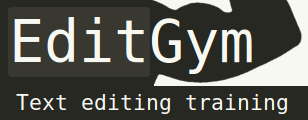

#[EditGym](http://www.editgym.com/)

###Text editing training

A lot of daily tasks require you to edit text. And no matter if you use a word processor like [LibreOffice Writer](https://www.libreoffice.org/discover/writer) or [Word](http://en.wikipedia.org/wiki/Microsoft_Word), an editor like [Notepad(++)](http://notepad-plus-plus.org), an [IDE](http://en.wikipedia.org/wiki/Integrated_development_environment) like [Eclipse](https://eclipse.org) etc. or just write an email or a post on [facebook](http://www.facebook.com) or [reddit](http://www.reddit.com) in your browser, the most basic default keyboard shortcuts are the same. And knowing them can [save you](http://acrobolix.com/keyboarding-changed-my-life/) [precious time](http://lifehacker.com/5970089/back-to-the-basics-learn-to-use-keyboard-shortcuts-like-a-ninja).

But real efficiency is not reached by [just memorizing all shortcuts](https://www.shortcutfoo.com). It is also important (and fun!) to be able to effortlessly choose the tactics with the smallest amount of shortcuts to reach the desired goal.

EditGym helps you to acquire this set of skills by letting you practice with standardized text snippets.

---

Issues:
 * [problems with shortcuts on a Mac](http://www.reddit.com/r/webdev/comments/2q3vdq/editgymcom_a_website_for_practicing_to_rearrange/cn3dl69)